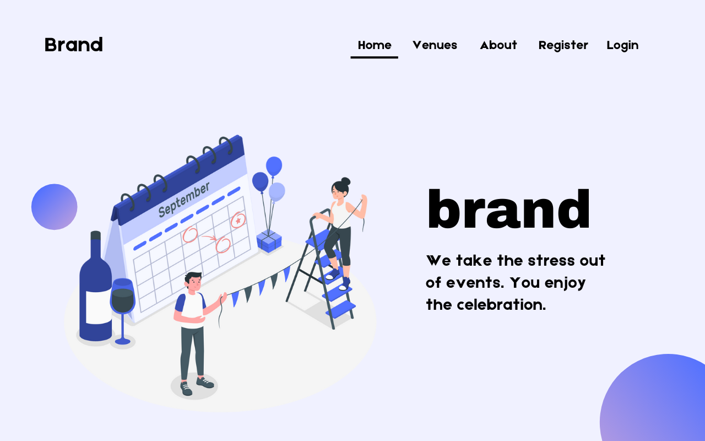
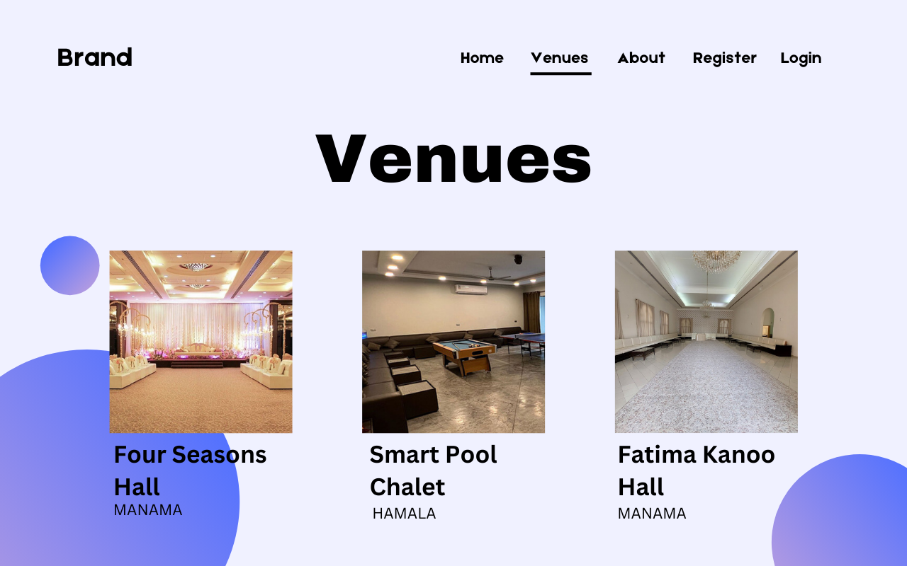

# Event Management System

### Team Members

- Fatema Aljonaid - [Github](https://github.com/Fatema-J) | [Linkedin](https://www.linkedin.com/in/fatema-aljonaid/)
- Amal AbdulJalil - [GitHub](https://github.com/Amal229) | [LinkedIn](https://www.linkedin.com/in/amalabduljalil/)
- Abeer Majeed    - [Github](https://github.com/AbeerMajeed) | [Linkedin](https://www.linkedin.com/in/abeerhhasan)
- Abdulla Hisham  - [Github](Https://github.com/chupa1997) | [Linkedin](https://www.linkedin.com/in/aboodisa)
- Afrah Mohammd   - [Github](https://github.com/Afrah-9903) | [Linkedin](https://www.linkedin.com/in/afrah-mohd)

  ---

### Overview


**_Event Management System_** is a web application designed to manage and organize events for users and vendors. The user is allowed to book an appropriate venue for his events while the vendor can manage the event and venue, edit,delete or update it. 
---

### Key Features

1. **Book a venue for an event:** Users can book an event with a specific venue.
2. **Update venue details:** Vendor can update venue details.
3. **Delete venue:** Vendor can delete a venue.
4. **View user venue:** Vendor can view the user venue events.

---

### Getting Started

1. Clone both [backend](https://github.com/Amal229/EventManagementSystem_Back-end.git) and [frontend](https://github.com/Amal229/EventManagementSystem_Front-end.git) repositories.
   - `git@github.com:Amal229/EventManagementSystem_Back-end.git`
   - `git@github.com:Amal229/EventManagementSystem_Front-end.git`
2. Install dependencies for each app (`npm install`).
3. Set up your MongoDB database.
4. Create .env file in the backend repository contains these varaibles

```
MONGODB_URI=<connection to mongodb>
APP_SECRET=<random String>
SALT_ROUNDS=<Number>
GROQ_API_KEY=<api key for groq>
```

5. Run the front-end and back-end servers.
6. Access the app locally.

---
### Technologies Used

- Front-end: **React**
- Back-end: **Node.js, Express.js**
- Database: **MongoDB**
- Deployment: **Render, Surge**
- Project Management: **Trello, Slack**
- Designing Phase: **Canva**
  - [component hierarchy diagram](https://trello.com/1/cards/66856759a71e10e566588620/attachments/6685676266d67bf6346cafee/download/Screenshot_2024-07-03_at_5.59.25_PM.png)
  - [wireframe](https://www.canva.com/design/DAGJ4jqxPO8/ztXD6WS_Zn6BTq2LUCTorw/edit?utm_content=DA[…]m_campaign=designshare&utm_medium=link2&utm_source=sharebutton)
  - [ERD](https://trello.com/1/cards/6685499be12d6b80cf036d87/attachments/66854ac58e33538ea85a7c6c/download/Screenshot_2024-07-03_at_3.57.14_PM.png)

---
### Deployment and Live Demo

- [EMS deployed website]()
- [Trello board](https://trello.com/invite/b/xms18rJ1/ATTIaf4adfde3d1660f0b34f53d848fe30bfCBD50F73/project-4)
- Screenshots:

<div align="center">
  <pre>
    &nbsp;&nbsp;&nbsp;&nbsp;&nbsp;&nbsp;
  </pre>
</div>

---
### Additional Features
- [] AI venue suggestions.
- [] Auto tasks
- [] Dark mode
- [] Invitation ‘text to speech’ with friendly character
- [] Different designs for invetition.


---

### Credits

- illustrations from [storyset.com](storyset.com)
- scrollable images in readme from [/shelf project](https://github.com/NobodysLackey/shelf/blob/main/README.md)


